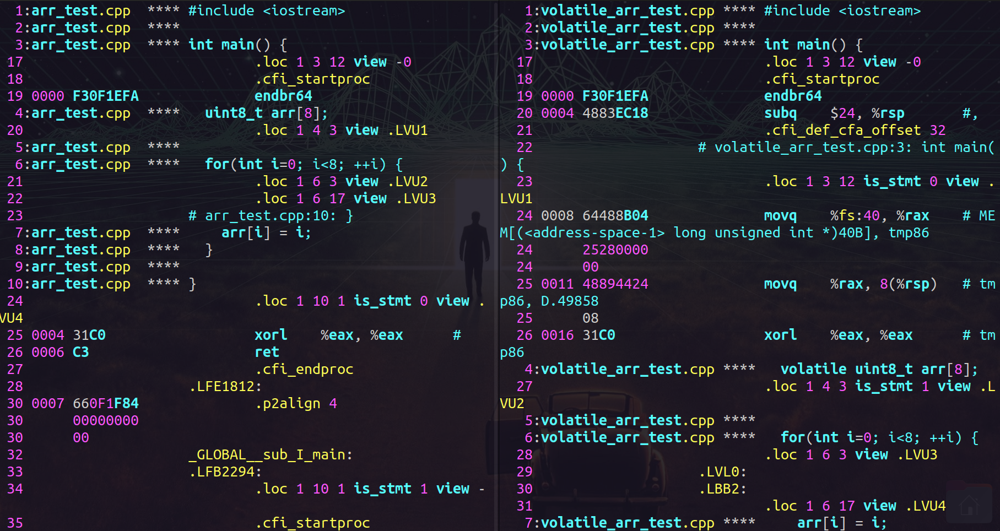

# Yet another assignment for probationers.

## Differences between array & volatile array

An array marked as volatile is allocated a special memory section (not in a CPU register). Because of this, the volatile array is treated as an external entity (such as I/O hardware). Additionally, it prevent compiler from optimizing access to this array when it appears unnecessary from program's perspective.
```
24 0008 64488B04         movq %fs:40, %rax   # MEM[(<address-space-1> long unsigned int *)40B], tmp86
```
  
## TLV
Under the hood:
```
  // Serialize
  char* sm = reinterpret_cast<char*>(&m);

  // Deserialize
  Message* new_m = reinterpret_cast<Message*>(sm); 
```

## Bit mask
Under the hood:
```
inline uint32_t inline_mask(const size_t& length
                          , const size_t& pos) {
    uint32_t result = 0;
    
    for(size_t i = pos; i<pos+length; ++i) {
      result |= 1<<i;
    }
    
    return result;
}
```

## Useful links
[Assembly code](https://stackoverflow.com/a/137479)

## Docs
[Docs](Docs/)
